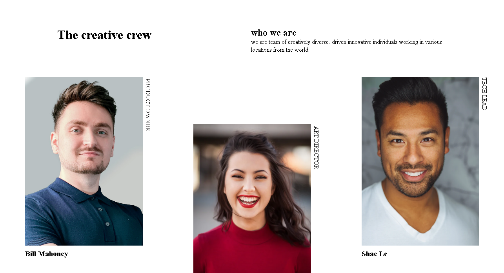
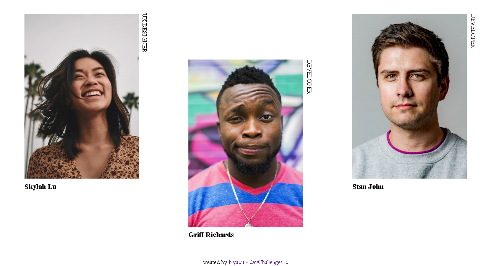
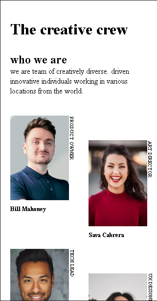
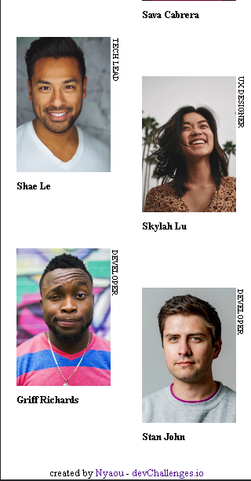

<h1 align="center">My Team Page</h1>

   Solution for a challenge from  <a href="http://devchallenges.io" target="_blank">Devchallenges.io</a>.

  <h3>
    <a href="https://nyaou.github.io/my-team-page">
      Demo
    </a>
     | 
    <a href="https://github.com/Nyaou/my-team-page">
      Solution
    </a>
     | 
    <a href="https://devchallenges.io/challenges/hhmesazsqgKXrTkYkt0U">
      Challenge
    </a>
  </h3>

## Table of Contents

- [Overview](#overview)
  - [Built With](#built-with)
- [Features](#features)
- [Contact](#contact)
- [Acknowledgements](#acknowledgements)

<!-- OVERVIEW -->

## Overview

### Built With

- Html5
- Css3

## Features

This application/site was created as a submission to a [DevChallenges](https://devchallenges.io/challenges) challenge. The [challenge](https://devchallenges.io/challenges/hhmesazsqgKXrTkYkt0U) was to build an application to complete the given user stories.

## Acknowledgements

- [Marked - a markdown parser](https://github.com/chjj/marked)

## Contact

- Website [portifolio](https://nyaou.github.io/portifolio/)
- GitHub [Nyaou](https://github.com/Nyaou)
- Linkedin [Jefferson Andrade](https://www.linkedin.com/in/jefferson-andrade-080221223/)
